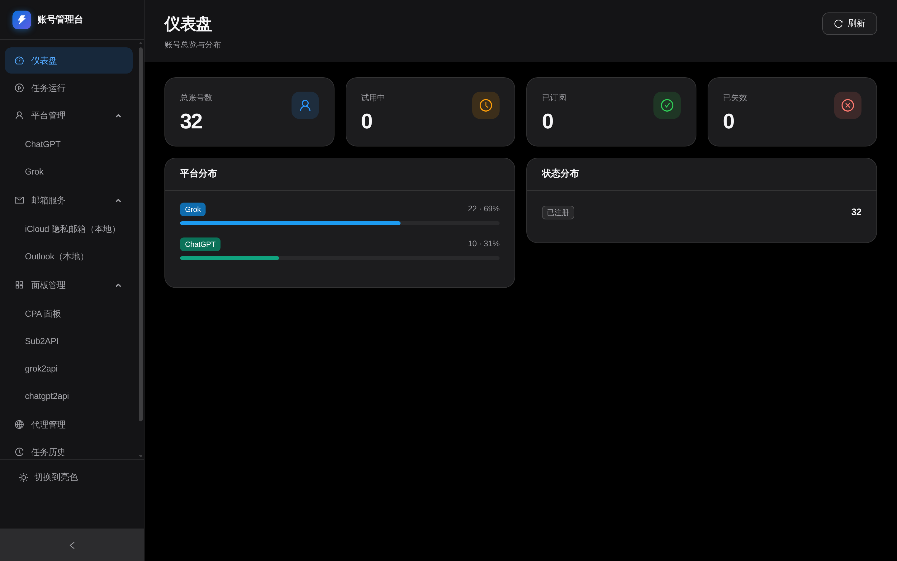
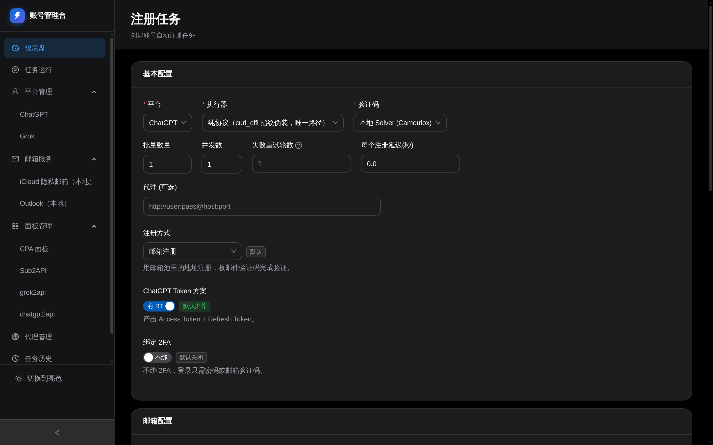
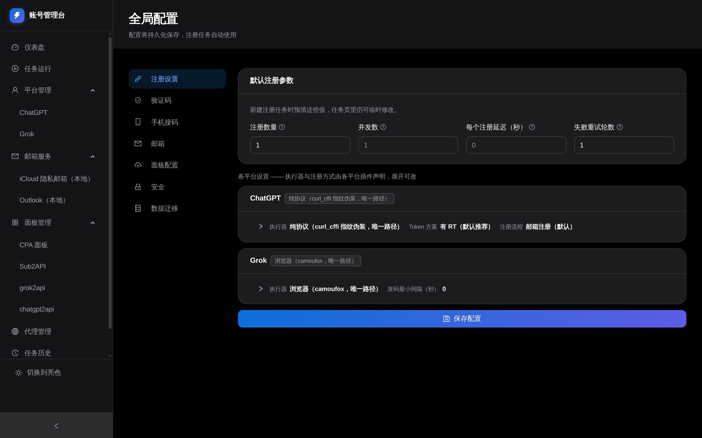

# 账号管理台

多平台账号自动注册与管理系统：插件化平台层、Web 管理台、批量注册、邮箱号池、
面板对比上传、数据一键迁移，并随后端自动拉起本地 Turnstile Solver。

- **平台**：ChatGPT（纯协议，无需浏览器）、Grok（camoufox 浏览器路径）
- **邮箱来源**：iCloud 隐私邮箱（本地）、Outlook / Hotmail（本地号池）
- **面板对接**：CPA（CLIProxyAPI）、Sub2API、grok2api、chatgpt2api

> ⚠️ 免责声明：本项目仅供学习与研究使用，不得用于任何商业用途。使用本项目所产生的一切后果由使用者自行承担。

## 目录

- [核心概念](#核心概念)
- [界面导览](#界面导览)
- [功能特性](#功能特性)
- [ChatGPT 专项能力](#chatgpt-专项能力)
- [Grok 专项能力](#grok-专项能力)
- [邮箱服务](#邮箱服务)
- [面板对接](#面板对接)
- [导出格式](#导出格式)
- [快速开始](#快速开始)
- [Docker 部署](#docker-部署)
- [数据目录与迁移](#数据目录与迁移)
- [环境变量](#环境变量)
- [常见问题排查](#常见问题排查)
- [项目结构](#项目结构)
- [界面预览](#界面预览)

## 核心概念

| 概念 | 说明 |
| --- | --- |
| **平台插件** | 一个平台 = 一个 `BasePlatform` 子类（`platforms/<name>/plugin.py`），启动时自注册。新增平台见 [EXTENDING.md](docs/EXTENDING.md) |
| **执行器** | 注册执行方式。**每个平台声明自己支持哪些**，没有全局默认 —— ChatGPT 只有 `protocol`，Grok 只有 `browser` |
| **邮箱渠道** | 可插拔收件来源，统一 `BaseMailbox` 接口。**邮箱按平台消耗** —— 同一地址注册过 ChatGPT 仍可注册 Grok |
| **号池状态** | `unpooled`（未入池）/ `available`（可领）/ `in_use`（使用中）/ `used`（已用）/ `failed`（失败） |
| **任务** | 一次注册作业。支持协作式停止 / 跳过，靠各层主动调用 `checkpoint()` 生效 |
| **面板** | 注册产物的下游消费方（CPA / Sub2API / grok2api / chatgpt2api），**全部是独立部署的远程服务**，本应用不安装、不启动它们 |

## 界面导览

侧栏一级菜单（共 8 项），二级项由后端接口下发，注册表加一项前端自动多一项：

| 一级菜单 | 二级 | 用途 |
| --- | --- | --- |
| **仪表盘** | — | 账号总览与分布（总数 / 试用中 / 已订阅 / 已失效） |
| **任务运行** | — | 进行中与已完成的任务，实时日志流 |
| **平台管理** | ChatGPT / Grok | 按平台的账号列表、详情、导入导出、批量操作、注册弹窗 |
| **邮箱服务** | iCloud 隐私邮箱（本地）/ Outlook（本地） | 各邮箱来源的号池维护 |
| **面板管理** | CPA 面板 / Sub2API / grok2api / chatgpt2api | 面板入口卡片 + 本地 ↔ 远程账号对比 |
| **代理管理** | — | 代理池增删与健康检查 |
| **任务历史** | — | 注册任务执行记录，支持批量删除 |
| **全局配置** | 注册设置 / 验证码 / 手机接码 / 邮箱 / 面板配置 / 安全 / 数据迁移 | 全局默认值与集成配置 |

**日常注册**从「平台管理 → 注册」按钮走弹窗即可；`/register` 是一个独立的注册任务页
（可直连 URL 打开，表单更完整），不是侧栏入口。

> 旧路径 `/platform-config`、`/icloud` 等做了重定向，老书签不会 404。

## 功能特性

- **多平台账号注册与管理**：统一的账号列表、详情、导入（文本 / JSON 全字段）、多格式导出、删除、批量操作
- **iCloud 隐私邮箱**：Apple ID 主号登录（SRP + 双重认证 / Cookie 导入）、Hide My Email 批量生成与收件箱查看
- **多邮箱服务接入**：iCloud 隐私邮箱（本地）、Outlook / Hotmail 本地号池
- **验证码支持**：YesCaptcha、本地 Turnstile Solver（Camoufox）、手动
- **手机接码**：SmsBower / HeroSMS 自动租号收码，ChatGPT 命中 add-phone 时全程无人值守
- **代理能力**：代理池轮询、代理状态维护；账号**保留注册代理**，复用时优先走同一个出口（无绑定或绑定失效会在后续操作中自动补上/更新）
- **批量注册**：注册数量、并发数、每个账号启动延迟、失败重试轮数
- **实时日志**：前端实时查看注册日志（SSE 流）
- **任务历史管理**：历史记录查看与批量删除
- **面板对比**：本地 ↔ 远程账号逐项比对（凭证是否一致），并在对比页直接上传 / 同步
- **数据迁移**：数据与配置一键导出 / 导入（服务迁移用）
- **插件化扩展**：按需接入外部面板与独立管理端

## ChatGPT 专项能力

ChatGPT 是当前功能最完整的平台：支持注册、Token 生命周期管理、状态探测和外部系统同步。

### 1. 注册协议（纯协议，无需浏览器）

整条注册链路位于 `platforms/chatgpt/protocol/`：

- `http_client.py` —— 基于 `curl_cffi` 的 TLS 指纹会话
- `auth_flow.py` —— 驱动 OpenAI authorize 状态机（注册、OTP、add-phone、Codex OAuth）
- `sentinel_quickjs.py` + `openai_sentinel_quickjs.js` —— 在 Node 沙箱里跑 OpenAI 真实的 `sdk.js` 求解 Sentinel PoW

> ⚠️ **Sentinel 需要 Node 运行时。** 自己合成的 PoW token 能骗过 `/sentinel/req` 的表层校验，但发码服务会在服务端复核，结果是验证码邮件被静默丢弃 —— 链路看着一切正常却永远收不到码。所以必须有可执行的 `node`（>= 18），不在 `PATH` 里时用 `OPENAI_SENTINEL_NODE_PATH` 指定绝对路径。

协议层之上只有一组注入点：邮箱池适配器、手机接码控制器、密码生效回调；开启 2FA 绑定时还会再挂一个 session 就绪钩子。任务级配置通过实例参数下传，**不写进程环境变量**，因此多个注册任务并发时互不干扰。

### 2. Token 方案（有 RT / 无 RT）

| 方案 | 行为 | 产出 |
| --- | --- | --- |
| **有 RT**（默认推荐） | 完整跑一遍 Codex OAuth | Access Token + Refresh Token |
| **无 RT** | 跳过 Codex OAuth（每次省约 10 秒） | 仅 Access Token / Session；依赖 RT 的后续能力可能不可用 |

全局默认在「全局配置 → 注册设置」；注册任务页与 ChatGPT 注册弹窗都可临时覆盖（任务页的值随任务提交，优先级更高）。

### 3. 注册流程（邮箱 / 手机 / 手机 + 邮箱）

| 流程 | 行为 |
| --- | --- |
| **邮箱注册**（默认） | 从邮箱池领地址，收邮件验证码 |
| **手机注册** | 从接码平台租号，收短信验证码，不占用邮箱；账号以手机号为标识 |
| **手机注册 + 绑定邮箱** | 先用号码注册，再把邮箱池里的地址绑到账号上，收一次邮件验证码；绑定成功后账号按邮箱记账，手机号随账号保存（导出格式 `email_pw_2fa_phone` 可带出） |

后两种都要先在「全局配置 → 手机接码」启用接码并填好 API Key，否则任务直接报错。
绑定邮箱这一步只在 OpenAI 把 add-email 摆进当前 authorize 流程时才会被接受；
被拒时账号照常保留，失败原因记在账号记录里（`bind_email_error`）；暂无单独补绑的入口。

**关于「失败重试轮数」**：整条流程失败后自动重开一轮（换新邮箱 / 号码 / 会话），与接码层的「最多换号」是两回事。手机注册中「号已建好、接码平台一条短信都没收到」这类重开也没用的失败，连续出现两轮后会提前收手、不再消耗剩余轮次 —— 再开只会多几个没人认领的号。

### 4. TOTP 2FA 绑定

注册任务页与 ChatGPT 注册弹窗上都有「绑定 2FA」开关，**默认关闭**。打开后注册成功的号会顺手绑一个 TOTP 双因素：

- **快路径**：复用注册那条会话直接申请密钥并激活。注册链几十秒前才做完验证，服务端认这是「最近认证过」，所以不用重新登录、不用再收邮件，几秒钟完事。
- **慢路径**：快路径没成时才走，用邮箱 + 密码重跑一遍登录正式链再绑，要多花一次 PoW，多半还要收一封验证码邮件。手机号身份的号没有邮箱可登，会跳过这一步。

密钥随号落库（写进账号 `extra` 的 `totp_secret`），三个地方都能复制导入验证器 App：
账号列表的「2FA 已绑」标签、账号操作菜单的「复制 2FA 密钥」、账号详情的密钥栏。
批量拿密钥用导出格式 `email_pw_2fa` 之类。

库里的老号可在账号操作菜单点「绑定 2FA」单独补绑，同样先试复用会话、会话失效再走重新登录。
这个动作和「补 RT」一样跑成后台任务：点完立刻弹出日志窗口，实时看到走哪条路、
是不是在等验证码，也能中途停掉。

> ⚠️ 密钥只在绑定那一刻由服务端下发一次，任何接口都取不回。绑定即生效，之后该号每次登录都要动态码 —— 补 RT、重新登录这些链路会自动用库里的密钥算码通过，但**密钥丢了这个号就再也登不进去**。

### 5. 账号操作与批量能力

**账号页（单账号 + 批量）**：探测本地状态、检测 Plus 试用、刷新 Token、补 RT、绑定 2FA、
复制 2FA 密钥。批量入口按「所选」或「当前筛选范围」作用。

**补 RT** 的语义：先用库里的会话直接换 `refresh_token`；会话失效时再用邮箱密码重新登录
（可能需要收一封验证码）。跑成后台任务，日志弹窗实时显示。

**面板动作**（上传 CPA / 上传 Sub2API / 上传 chatgpt2api / 同步 CLIProxyAPI 状态）
已从账号页移到「面板管理」页 —— 目标是外部面板，与账号自身状态不是一回事。
账号页菜单按 `scope` 过滤掉它们（见 `platforms/chatgpt/plugin.py` 的 `get_platform_actions`）。

## Grok 专项能力

Grok 注册**只有浏览器一条路径**：x.ai 的 Cloudflare 只有 camoufox 能过，
协议层的发码是「假接受」（gRPC `grpc-status:0` / REST `ok:true` 但零投递）。

| 环节 | 实测结论 |
| --- | --- |
| 浏览器引擎 | **camoufox 是唯一能过 x.ai CF 的**；chromium 无论直连还是住宅代理，提交发码都被 403 |
| 发码 | 必须走真实页面（协议「假接受」） |
| 域名 | x.ai 接受主流域（@icloud.com 实测通过）；拒绝小域名 |
| 验证码 | 页面会自动格式化（`955-995` → `955995`），用键盘逐字输入才稳 |
| 提交按钮 | 是 `type=submit` 且**无文本**，按 Enter 最可靠 |
| OAuth | 协议 device flow 的 approve 被 CF 403，**必须走浏览器兜底** |

**发码节流**（`grok_send_code_min_interval`）：x.ai 对同一 IP 的取码有频率限制，太密会把
出口打进长冷却。界面在「注册设置 → 各平台设置 → Grok」卡片里渲染。

**账号操作**：测活（CLI Proxy）、重换 OAuth、导出 CPA JSON；面板动作同 ChatGPT
（上传 CPA / 同步 CPA 状态 / 上传 Sub2API / 上传 grok2api）。

**grok2api 接入**（`platforms/grok/grok2api.py`）：上传 SSO → 派生 Console / Build 两种凭据 →
开启 NSFW。只调 grok2api 现成的管理 API。几个关键点：

- 上传文件名**必须是** `grok-web-sso-tokens.txt`（grok2api 靠文件名识别 token 类型）
- 派生格式 grok2api **不会自动做**，要显式调 `sync-to-console` 与 `convert-to-build`
- 账号级动作（条款/生日/NSFW）只对 Web 账号有效，必须先按邮箱找到 `provider=grok_web` 那条
- NSFW 顺序不能换：`accept-terms` → `birth-date` → `nsfw`
- 管理面要**用户名+密码换 token**（不是固定 API Key），有效期约 10 分钟

## 邮箱服务

邮箱服务是**独立的一级菜单**，二级按「邮箱从哪来」分：

| 二级菜单 | 管什么 | 数据在哪 |
| --- | --- | --- |
| iCloud 隐私邮箱（本地） | iCloud 主号登录（SRP / Cookie）、Hide My Email 别名生成/停用、收件箱 | `data/platforms/icloud.db` |
| Outlook（本地） | 微软号池导入、收信方式（Graph / IMAP） | `data/platforms/outlook.db` |

两个号池**各自单独一个数据库文件**：它们是「邮箱来源」而不是注册平台，被多个注册流程共用，
单独成库才能一个文件备份、一个文件清空。详见 [EXTENDING.md 第 6.1 节](docs/EXTENDING.md)。

### 注册页的邮箱服务选项

| 选项 | 标识 | 取号范围 |
| --- | --- | --- |
| Outlook（微软号池） | `microsoft` | 见下方「导入类型」 |
| iCloud 隐私邮箱（本地主号） | `icloud_local` | 从已启用的 iCloud 主号生成隐私邮箱 |

**导入类型**（仅微软号池）：Outlook / Hotmail / MailAPI URL 三类共用同一个微软号池，
三类账号互不顶替 —— 选 MailAPI URL 只会取 `account_type=mailapi_url` 的账号，
选 Outlook / Hotmail 只会取 OAuth 账号。

**微软收信方式**：默认 Graph；没有 OAuth 凭据的账号运行时自动回退 IMAP。

### iCloud 隐私邮箱说明

**使用流程**：

1. 在「iCloud 隐私邮箱（本地）→ 主号管理」添加 Apple ID 主号：
   - **账号密码登录**：走 Apple SRP 协议，按需完成双重认证（可信设备推送或短信验证码）
   - **Cookie 导入**：直接粘贴浏览器导出的 iCloud Cookie
2. 登录成功后在「隐私邮箱」标签页批量生成别名。Apple 侧限制为**每主号每小时最多 5 个**，
   系统按主号维度自行限流。
3. 主号的 IMAP 密码（应用专用密码）用于拉取别名收件箱；未配置时回退 Web API（只有摘要）。

凭据均以 **AES-256-GCM** 加密后落库。加密密钥取自环境变量 `CREDENTIAL_ENCRYPTION_KEY`；
未设置时在 `data/secrets/credential_key` 自动生成一份本地密钥。

### 号池的两步流程（重要）

**粘贴邮箱只是把它们存进号池（状态「未入池」），注册任务不会取用。**
在预览表里勾选要用的邮箱，点「导入邮箱池」之后它们才可被领取。

- 「未入池」（`unpooled`）的地址注册取号会跳过，不会并进「可领」
- 取号优先复用「未使用」的地址
- 重复点「导入邮箱池」是幂等的：已在用的号不会被改回可领取
  （否则同一个号会被两个任务同时领走，两边互相顶掉验证码邮件）

## 面板对接

本应用**不安装、不启动**任何面板。面板都是独立部署的远程服务，这里只负责：

- 在「面板管理」页存它们的地址，提供跳转入口与 GitHub 项目主页直达
- 选中面板后展示**本地 ↔ 远程账号对比**：哪些本地号还没上传、凭证是否一致
  （AT/RT 全相同 = 已同步）、远端多出来的账号；带缓存与「同步到最新」
- **对比页上直接操作**：把「未上传」的号一键传上去、「凭证不同」的重传、
  同步远端状态回写本地（含封禁判定）—— 不用跳到账号列表再筛一遍
- 把注册好的账号推过去（`services/external_sync.py`）

| 面板 | 用途 | 项目主页 |
| --- | --- | --- |
| CPA 面板 | ChatGPT 账号上传与状态同步（CLIProxyAPI 的 `/v0/management/auth-files`） | <https://github.com/router-for-me/CLIProxyAPI> |
| Sub2API | 账号上传到 Sub2API 后台 | <https://github.com/Wei-Shaw/sub2api> |
| grok2api | Grok 账号池与 API 网关 | <https://github.com/chenyme/grok2api> |
| chatgpt2api | ChatGPT 网页号池（只认 `access_token`） | <https://github.com/yukkcat/chatgpt2api> |

**对比的匹配与判定**：匹配键是 **(平台, 邮箱)**（CPA 同时托管 ChatGPT 的 `codex` 与
Grok 的 `xai` 两类凭据）；主判据是**凭证本体是否相同**（AT/RT/session/id_token/sso），
时间（按小时比较）降为辅助信息。

**上传开关按平台分开**：CPA 的 ChatGPT 与 Grok 各自控制（`cpa_upload_chatgpt_enabled` /
`cpa_upload_grok_enabled`）；其余面板各有自己的 `*_enabled` 开关。

> **chatgpt2api 有两个同名项目**：`yukkcat/chatgpt2api`（v3.2.3）与
> `basketikun/chatgpt2api`（v1.8.0），上传器同一份代码两边都能用，但**读回账号状态
> 的字段形状不兼容**，本项目按 yukkcat 版的接口对接（列表不带 token、凭证走 export）。

**新增一个面板要同步注册几处**（漏一处症状都很难查）：
`services/panel_comparison.py` 的 `FETCHERS`（漏了报「未知面板」404）、
`services/panel_comparison_cache.py` 的 `_PANEL_PLATFORMS` 与 `_panel_credentials`、
平台插件的 `get_platform_actions`（`scope="panel"`）与 `api/actions.py::_apply_action_result`、
配置键白名单（`api/config.py`）+ 前端 `PanelConfigPanel.tsx` 表单。清单也写在
`services/panel_registry.py` 的模块 docstring 里。

## 导出格式

账号列表右上角「导出」打开导出弹窗：先选范围（勾选的账号 / 当前筛选出的全部账号，
翻页不影响），再选格式，右边直接出预览，然后一键复制或下载。

| 格式 | 一行长什么样 |
| --- | --- |
| `email_pw` | `邮箱----密码` |
| `email_pw_2fa`（默认） | `邮箱----密码----2FA 密钥` |
| `email_pw_2fa_at` | 再接 `----AccessToken` |
| `email_pw_2fa_rt` | 再接 `----RefreshToken` |
| `email_pw_2fa_at_rt` | 登录与调用凭证一次带齐 |
| `email_pw_2fa_phone` | 再接 `----手机号` |
| `email_pw_rt` | `邮箱----密码----RefreshToken` |
| `email_2fa` | `邮箱----2FA 密钥` |
| `at` / `rt` / `totp` | 一行一个 token，没有该字段的账号自动跳过 |
| `csv` / `json` | 全字段，给 Excel 或脚本用 |

**空字段照样占位**（`a@b.com----pw----` 结尾那个分隔符不会省），按 `----` 切列的脚本不会错位。
格式清单由后端 `services/account_export.py` 的 `EXPORT_FORMATS` 统一定义，加一个新格式
只改这一处，前端下拉框自动跟上。

## 快速开始

### 1. 创建并激活 Python 环境

```bash
python -m venv .venv && . .venv/bin/activate
# 或 conda create -n account-manager python=3.12 -y && conda activate account-manager
```

### 2. 安装后端依赖

```bash
pip install -r requirements.txt
```

### 3. 安装浏览器相关依赖

```bash
python -m playwright install chromium
python -m camoufox fetch
```

### 4. 安装并构建前端

```bash
cd frontend
npm install
npm run build
cd ..
```

构建完成后，静态资源输出到 `./static`。

### 5. 启动项目

```bash
python main.py
```

启动后默认访问 <http://localhost:8000>。

> 已经执行过 `npm run build` 时，前端由 FastAPI 直接托管，所以访问的是 `8000`，不是 `5173`。

### 前端开发模式

终端 1 启动后端（`python main.py`），终端 2：

```bash
cd frontend
npm run dev
```

访问 <http://localhost:5173>。Vite 会把 `/api` 请求代理到本地后端 `http://localhost:8000`。

### Turnstile Solver 说明

本地 Turnstile Solver 会在 FastAPI 后端启动时自动拉起，默认 <http://localhost:8889>。
前端「全局配置 → 验证码 → Turnstile Solver」显示的是**后端检测结果**，所以：

- 后端未启动 → 前端显示「未运行」
- 后端已启动但缺依赖 → Solver 可能启动失败（日志：`data/logs/solver.log`）

手动启动：

```bash
python services/turnstile_solver/start.py --browser_type camoufox --port 8889
```

## Docker 部署

```bash
cp .env.example .env              # 可选：按需改端口 / 数据目录 / 镜像源
docker compose up -d --build      # 启动
docker compose down               # 停止
docker compose logs -f app        # 日志
```

首次构建会额外下载 Python 依赖、Playwright Chromium 和 Camoufox，耗时明显更长。
Dockerfile 通过固定直链安装 Camoufox，避免构建时访问 GitHub Releases API 触发匿名限流。

**数据持久化**：整站运行数据都在一个目录下（见 [数据目录与迁移](#数据目录与迁移)），
宿主机只需挂载 `./data` 这一个卷。容器内数据根由 `DATA_DIR=/runtime` 指定，
`DATABASE_URL` 默认派生为 `sqlite:////runtime/account_manager.db`。

### 部署要点

- **端口可配**：`APP_PORT_BIND`（面板）、`SOLVER_PORT_BIND`（Solver）
  可在 `.env` 里改绑定地址，例 `127.0.0.1:8000` 只绑本机交给反代。
- **基础镜像可换**：Docker Hub 不可达时（TLS 失败 / 连接重置），在 `.env` 里设
  `NODE_IMAGE` / `PYTHON_IMAGE` 为可达的镜像源再构建，无需改 Dockerfile。
- **健康检查**：compose 带 `healthcheck`（探 `/api/auth/status`，豁免登录），
  `docker ps` 直接看得到 `healthy / unhealthy`。
- **日志上限**：`json-file` 日志已限制 `10m × 3`，长跑不会撑爆磁盘。
- **`.env` 注入**：写进 `.env` 的应用变量（`OPENAI_*` 等）会注入容器；
  `environment` 段里的键（`DATA_DIR` 等）以 compose 文件为准。

> ⚠️ **对外暴露前必须先设登录密码。** 没设密码时鉴权中间件会直接放行所有 `/api/` 请求。
> 这个面板管着账号、Token、接码 API Key、邮箱和代理凭据。先在「全局配置 → 安全」里
> 设密码，或：
>
> ```bash
> curl -X POST http://127.0.0.1:8000/api/auth/setup \
>      -H 'Content-Type: application/json' -d '{"password":"你的强密码"}'
> ```
>
> 设完确认无 token 会被挡：`curl -o /dev/null -w '%{http_code}\n' http://127.0.0.1:8000/api/config`（期望 401）。

任务日志走 SSE，nginx 反代时 `/api/tasks/` 必须关掉响应缓冲（`proxy_buffering off`），
否则前端看不到实时日志。

### Docker 使用建议

- 镜像主要覆盖主应用和本地 Turnstile Solver
- 面板（CPA / Sub2API / grok2api / chatgpt2api）需**自行部署在别处**，本应用不安装、不启动它们

## 数据目录与迁移

运行时产生的所有数据都在仓库根的 **`data/`** 下。代码侧唯一真相源是
[`core/paths.py`](core/paths.py)。完整规范见 [docs/DATA_DIRECTORY.md](docs/DATA_DIRECTORY.md)。

```text
data/
├── account_manager.db        默认库：任务、任务日志、代理、全局配置   ← 必须备份
├── platforms/                平台分库（账号随平台分库）              ← 必须备份
│   └── <platform>.db
├── secrets/
│   └── credential_key        凭据加密密钥（AES-256-GCM）             ← 必须备份
├── import_backups/           导入前自动留存的数据快照（可丢弃）
└── logs/                     应用自身日志（可丢弃）
```

> **一键迁移**：界面「全局配置 → 数据迁移」可把上面**必须备份**的三项打成一个 ZIP
> 导出，在另一台机器导入即完成迁移 —— 不用手工搬文件。
> 实现见 `services/data_bundle.py`，接口见 [docs/API_REFERENCE.md](docs/API_REFERENCE.md)
> 的 `/api/backup/*`。**日志与 `import_backups/` 刻意不进包**；导入前会自动备份到
> `data/import_backups/<时间戳>-<随机后缀>-import/`，导错了可以回退。

导出用的是 SQLite 的 `VACUUM INTO`（一致性快照），不是直接拷运行中的库文件 ——
WAL/journal 活跃时直接拷会拷到半个事务。

## 环境变量

| 变量名 | 默认值 | 说明 |
| --- | --- | --- |
| `HOST` | `0.0.0.0` | FastAPI 监听地址 |
| `PORT` | `8000` | FastAPI 监听端口 |
| `APP_RELOAD` | `0` | 设 `1` 时启用 uvicorn 热重载（开发用） |
| `DATA_DIR` | `<仓库根>/data`（容器内 `/runtime`） | 数据根目录 |
| `DATABASE_URL` | `sqlite:///$DATA_DIR/account_manager.db` | 默认库地址 |
| `DATABASE_URL_<PLATFORM>` | — | 平台分库地址（按平台名大写） |
| `PLATFORM_DATABASE_URLS` | — | 平台分库的 JSON 总表 |
| `CREDENTIAL_ENCRYPTION_KEY` | — | 凭据加密密钥本体（base64/hex），优先于密钥文件 |
| `CREDENTIAL_ENCRYPTION_KEY_FILE` | `$DATA_DIR/secrets/credential_key` | 凭据加密密钥文件 |
| `APP_ENABLE_SOLVER` | `1` | 是否自动启动本地 Solver，设 `0` 禁用 |
| `SOLVER_PORT` | `8889` | Solver 监听端口 |
| `SOLVER_BIND_HOST` | `0.0.0.0` | Solver 绑定地址 |
| `SOLVER_BROWSER_TYPE` | `camoufox` | Solver 用的浏览器类型 |
| `SOLVER_PROXY_ENABLED` | `1` | Solver 是否启用代理支持 |
| `LOCAL_SOLVER_URL` | `http://127.0.0.1:8889` | 后端访问 Solver 的地址 |
| `OPENAI_SENTINEL_NODE_PATH` | `node` | Sentinel PoW 求解器用的 Node 可执行文件（不在 `PATH` 时填绝对路径） |
| `APP_JWT_SECRET` | 自动生成并存库 | 面板登录态 JWT 签名密钥 |

如需传入 `OPENAI_*` 等配置：Docker 部署时写进仓库根的 `.env` 即可 —— compose 已带
`env_file: .env`（`required: false`，没建该文件也能启动），应用变量会注入容器。
本机直跑时在 shell 中 `export`（`.env` 仅被配置存储作为缺省值读取）。
`environment` 段里已写死的键（`DATA_DIR` 等）以 compose 文件为准。

## 常见问题排查

### 1. 前端里 Turnstile Solver 显示「未运行」

先检查后端是否正常启动：

```bash
curl http://localhost:8000/api/solver/status
```

正常返回 `{"running":true}`。若 `8000` 端口都访问不到，问题在后端而不是 Solver 本身。

### 2. 如何确认当前 Python 是否正确

```bash
python -c "import sys; print(sys.executable)"
```

输出的解释器应当就是安装依赖时用的那个；不是就说明环境没激活对。

### 3. 端口被占用

后端启动报 `address already in use` 时，先找到占用端口的进程停掉，再重新启动：

```bash
ss -tlnp | grep :8000      # Linux
netstat -ano | findstr :8000   # Windows
```

### 4. ChatGPT 注册收不到验证码

先确认 `node` 可执行（`node --version`）。Sentinel PoW 求解器要在 Node 沙箱里跑 OpenAI 的
`sdk.js`，没有 Node 时算出来的 token 过不了服务端复核，**验证码邮件会被静默丢弃** ——
日志上看不到明显报错，但码永远收不到。若 `node` 不在 `PATH` 里，用
`OPENAI_SENTINEL_NODE_PATH` 指定绝对路径。

### 5. 注册报「池里没有可用账号」

邮箱导入后**还要勾选入池**。粘贴只是把它们存进号池（状态「未入池」），
在预览表里勾选要用的邮箱、点「导入邮箱池」之后才可被领取。

### 6. Grok 注册发码失败

Grok 只有 camoufox 浏览器路径。确认 Solver/browser 依赖已装
（`python -m camoufox fetch`），并检查发码节流（`grok_send_code_min_interval`）——
x.ai 对同一 IP 的取码有频率限制，太密会把出口打进长冷却。

## 项目结构

```text
Register/
├── api/                  FastAPI 路由层（config / accounts / tasks / actions / backup / auth…）
├── core/                 抽象基类、注册表、任务运行时、DB 层、代理、执行器、邮箱池
├── platforms/            平台插件（chatgpt / grok）+ 邮箱客户端（icloud）
├── services/             跨平台服务：邮箱池、面板注册表与对比、外部同步、数据迁移
├── modules/              面向复用的轻量业务模块层
├── frontend/             React + TypeScript + Vite 管理台（构建产物进 static/）
├── scripts/              运行时脚本（camoufox 安装、Turnstile 铸造等）
├── tests/                pytest 测试
├── docs/                 主题专文（接口、扩展、分库、目录规范）
├── data/                 运行时数据（见「数据目录与迁移」，不进版本控制）
├── docker/               容器启动脚本
├── main.py               应用入口
├── requirements.txt
├── Dockerfile
└── docker-compose.yml
```

技术栈：后端 FastAPI + SQLite（SQLModel）；前端 React + TypeScript + Vite；
HTTP 用 curl_cffi；浏览器自动化用 Playwright / Camoufox；ChatGPT 注册协议纯协议实现，
Sentinel PoW 走 Node 沙箱。

## 界面预览

### 仪表盘



### 注册任务



### 全局配置


